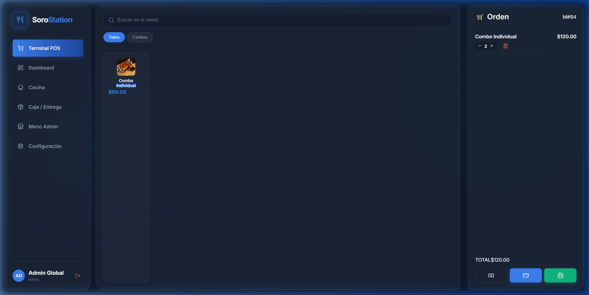
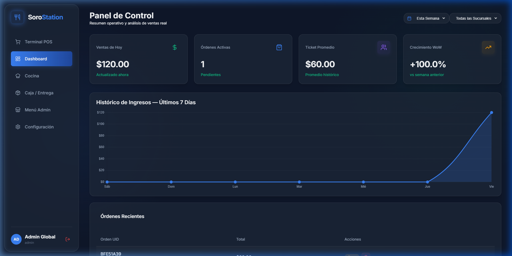
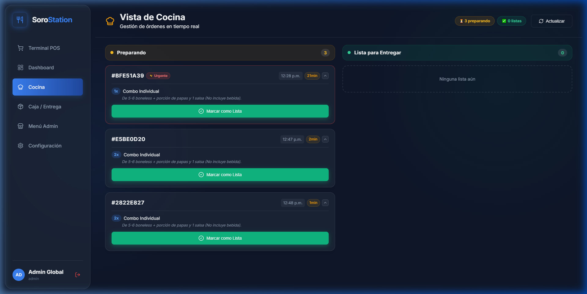
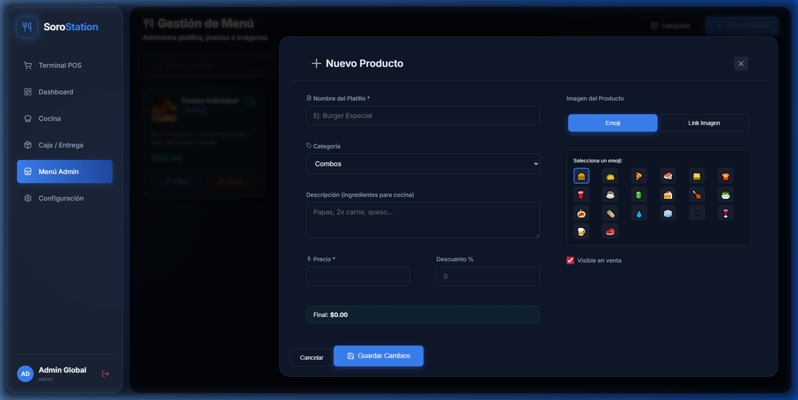
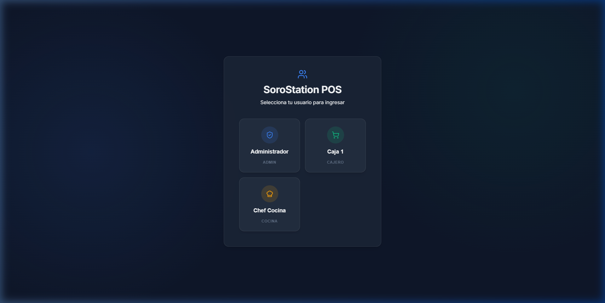

# 🍔 SoroStation POS - Sistema de Punto de Venta Moderno

SoroStation es un sistema de Punto de Venta (POS) integral diseñado para optimizar la operación de restaurantes y estaciones de comida. Desarrollado con una arquitectura moderna que prioriza la velocidad, la sincronización en tiempo real y una experiencia de usuario premium tanto en escritorio como en dispositivos móviles.



## 🚀 Características Principales

### 📊 Dashboard Administrativo Real-Time
Monitoreo total del negocio con métricas calculadas al instante.
- **Ventas del Día:** Seguimiento de ingresos brutos diarios.
- **Crecimiento WoW:** Comparativa inteligente de rendimiento semana tras semana.
- **Ticket Promedio:** Análisis dinámico del valor por cliente.
- **Gestión de Órdenes:** Control total sobre el estado de preparación y eliminación de registros.



### 🥖 Terminal POS (Caja)
Interfaz diseñada para la velocidad y precisión en el cobro.
- **Catálogo Visual:** Soporte para imágenes personalizadas vía URL o sistema de Emojis dinámicos.
- **Sistema de Descuentos:** Aplicación de promociones directamente en la terminal con vista de precio original vs. final.
- **Pagos Flexibles:** Procesamiento de pagos en efectivo (con calculadora de cambio) y terminal bancaria.
- **Impresión de Tickets:** Optimizado para impresoras térmicas de 58mm con desglose de Subtotal, IVA y Total.


### 🧑‍🍳 Módulo de Cocina Synced
Sincronización instantánea mediante Supabase Realtime.
- **Pedidos al Momento:** La cocina recibe las órdenes en segundos sin necesidad de refrescar la página.
- **Ingredientes en Pantalla:** Vista detallada de los componentes del platillo para evitar errores en la preparación.
- **Alertas de "Listo":** Notificaciones automáticas al cajero cuando un pedido sale de preparación.



### 🛠️ Gestor de Menú Avanzado
Control absoluto sobre los productos y categorías.
- **Editor en Pantalla Completa:** Modal diseñado exclusivamente para web que permite gestionar todos los datos de un platillo sin scroll.
- **Categorías Dinámicas:** Crea y ordena categorías para facilitar la búsqueda en la terminal.
- **Toggle de Visibilidad:** Oculta o muestra productos del catálogo con un solo clic.



## 🛠️ Stack Tecnológico

- **Frontend:** React 19 + TypeScript
- **Build Tool:** Vite
- **Base de Datos & Realtime:** Supabase (PostgreSQL)
- **Icons:** Lucide React
- **Estilos:** Vanilla CSS (Modern CSS Variables & Glassmorphism)
- **Gráficas:** Chart.js

## 📦 Instalación y Configuración

1.  **Clonar el repositorio:**
    ```bash
    git clone [url-del-repo]
    cd pos-soro-station
    ```

2.  **Instalar dependencias:**
    ```bash
    npm install
    ```

3.  **Configurar Variables de Entorno:**
    Crea un archivo `.env.local` en la raíz con tus credenciales de Supabase:
    ```env
    VITE_SUPABASE_URL=tus-url-aqui
    VITE_SUPABASE_ANON_KEY=tu-anon-key-aqui
    ```

4.  **Iniciar Servidor de Desarrollo:**
    ```bash
    npm run dev
    ```

## 🔒 Seguridad y Acceso
El sistema cuenta con una pantalla de inicio de sesión protegida por PIN para diferentes niveles de acceso:
- **Admin:** Acceso total (Dashboard, Menú, Caja, Cocina).
- **Cajero:** Acceso a POS y Entrega.
- **Cocina:** Acceso exclusivo a la gestión de pedidos listos.



---
*Desarrollado para Soro Station - Maximizado para la eficiencia operativa.*
